引用
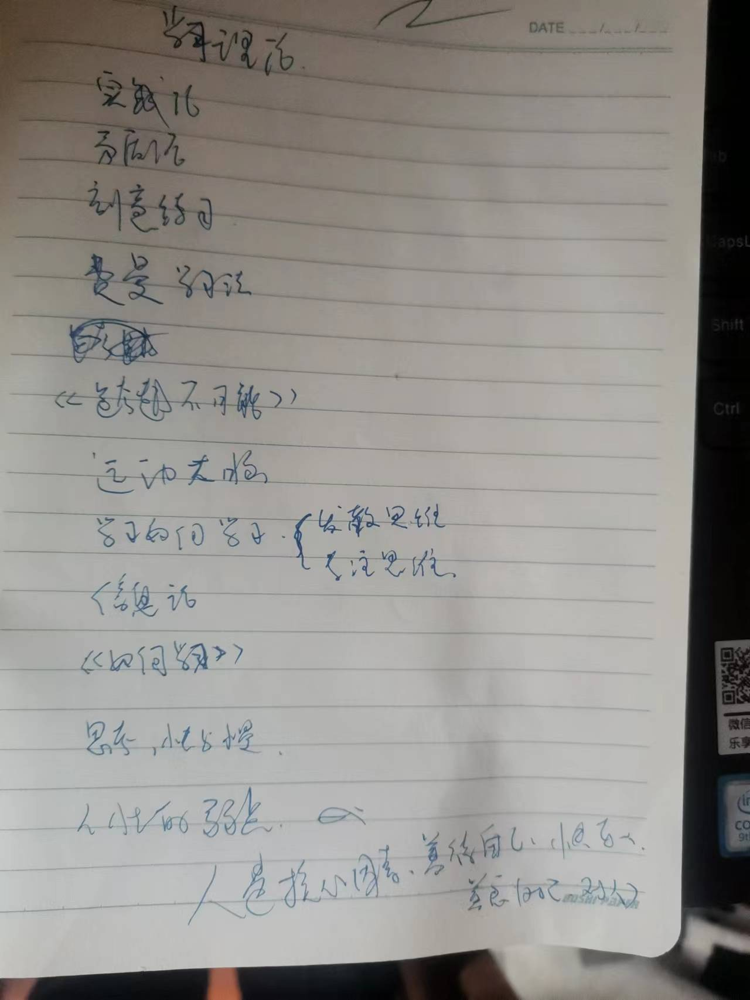

这门课的主讲人：Barbara Oakley 

# 《专注模式和发散模式》

引子：当你遇到无法解决的事情，你该怎么办？  

大脑工作机制 
	专注思维 Focus 
	发散思维 Diffuse 

发散模式，跟一组神经休眠状态有关，它是一种更放松的思维 

在目前的认知水平下，我们得到的结论是，我们无法同时处于专注模式
和发散模式下工作和思考问题。要么就是处于专注模式下，要不就是处于
发散模式下。 

伟大的人如何使用发散思维做伟大的事情 

# 《使用发散思维和专注思维》
萨尔瓦多·达利, 是一位二十世纪的超现实主义的画家。 
	他有一个技巧来帮助他构思超现实主义的画作，坐在椅子上，非常放松的任由大脑思考，不去阻碍不去引导，身体很放松，
	手上拿一串钥匙，睡着那一刻钥匙会掉，这样会把他吵醒，然后他会把发散模式下创造的东西收集起来，在专注模式下把
	它画出来。
爱迪生 ，也用过类似的方法，他也是一样，不过手里拿的是滚珠轴承。 

所以，我们在学习新事物，尤其是困难的事物。需要两种思维模式都使用起来，你的大脑需要在这两种模式之间来回切换。
在解决困难问题也是如此。 

我们需要长时间的不间断的训练才能习得一个技能。这就像举重一样，你不能期待通过比赛前一天大量魔鬼的训练就能
参加比赛，这不可行。你必须是每天的举重训练，日复一日的，这样才能建立起肌肉结构，支撑你的举重。 
学习也是如此，尤其是学习困难的事物，必须每天学习一天不间断，这样才能建立起神经结构，来支持你的思考决策。 

总结 Summary 
- 比喻是一个厉害的学习方法 
- 专注模式和发散模式 
- 学习困难的事情，需要时间。不是短时间就可行的 

# 《什么是学习》
访问https://www.brainfacts.org 时常更新你的大脑神经科学知识。

我们的大脑是个耗能大户，在不主动进行思考时，消耗的能量也要占到全身耗能热量的20%~30% 。 
大脑是最重要的器官，已知宇宙中最精密、复杂的设备，你所有的希望、恐惧、想法都存在大脑的神经元中。 

在你的大脑中有亿次方个 可以存储记忆的突触，所以别吝啬你的记忆呗。全世界所有的事物你大脑都能装的下。  

在过去的观点认为，大脑发育成熟，后天的学习只会调节突触的强度，而不会改变突触之间的联系(除非大脑损伤). 
现在我们知道突触之间的连接是动态的，即使在大脑发育成熟后。

利用光学成像技术，对大脑神经元突触进行成像。发现旧的突触不断消失，新的突触不断生成。
那么问题来了，为什么突触这么频繁的更新换代的同时，我们的记忆还能保存很多年？  

突触的直径小于1微米，相比之下人头发直径有20微米。

学习是可以改变大脑结构的  

有趣的是，在睡一觉甚至是打个盹和你在睡前就不是同一个人了。
睡觉能让你大脑升级。 

# 《拖延症预览》
当我们面对困难的事情，我们一般会心生抗拒，不愿意做，此时此刻大脑痛苦的区域被激活，
我们会转移注意，做一些容易的事情，能立马获得爽快的事情，譬如玩手机游戏，刷抖音。
但是这些愉悦是短暂的，随后空虚荒芜，情感枯竭会覆盖你，让你窒息。 

令人开心的是，解决这个拖延症不难。研究者发现，当我们直面困难的事情，过一些些时间这些痛苦的
情绪会消失。 

我们人性还是喜欢容易的事情，不喜欢困难的。基于此
我提出了时间片的工作方法来挑战拖延症。将时间切成小片，长时间集中不了注意，但短时间我可以。
- 25mins (时间片) 
- 不能分心(自己监控自己，发现有分心迹象，拉回自己，告诉自己没多久时间就可以玩了)
- 奖励自己  

你会发现我说的 时间片工作法，和著名的番茄工作法是一样的 
番茄工作法
- 25mins 
- 专注
- 不能中断
- 奖励 

那为何我要提我的时间片呢？ 因为我提出时间片工作法时，我未曾了解知道过 番茄工作法。 

对于困难的学习和工作任务，我们可以使用这个简单的 番茄工作法来面对拖延症。 
但面对 情感的，人生的困难，这小小番茄工作法起不来作用。起作用的只有，直面它。 

# 《熟能生巧》
抽象，在现实世界里很难找到与抽象概念对应的事物。 难以理解 

将所学到的知识应用于实践，这超级重要。如此会加强你学习过程中的神经联系。  
notice: 实践  

通过反复实践，神经元联系到一起了。越是抽象的东西，越要反复练习。 

虽然你思考的东西是抽象的，但建立的神经思维模式却是实打实存在你脑子里的。 

学习过程中，你神经元连接的变化  
1. 当你开始理解某件事的时候 ，你的神经元已经建立起连接，形成了神经模式，但很微弱，就像下图中，最微弱的连接一样。 
2. 加强神经模式，当你独立的讲解某事物，或独立解决问题，你的神经模式得到加强，就如下图中间的连接，比最上面颜色更深。
3. 深色的坚固模式，当你练习很多遍，独立复盘，将其体系化后，这时候你的神经模式变得很坚固了。  
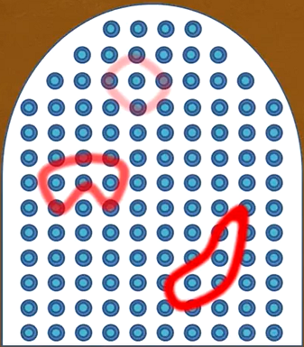

你在学习时候，你的目的就是要学会那些东西。 
你要做的是专注的努力学习，然后休息一会儿，或者做其它事情，反正就是要转移注意力，这个是要要使用发散模式了，让大脑在后台给你学习到的知识做深度加工。

通过每天训练  
专注模式和发散模式交替进行
你会发现，你的神经结构如下图一样，变得整齐有序，基础牢靠

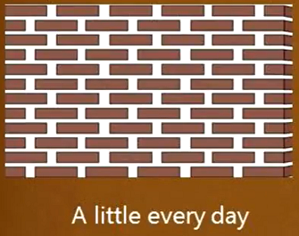

如果你乱学习，或者死记硬背，或者断断续续学习，你会发现
你的神经结构混乱不堪，基础很不牢靠

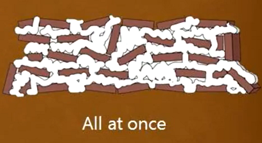

# 《记忆概论》
 
Long term memory   
Working memory  
这两种记忆是彼此联系的。  

工作记忆，是你记忆的一部分。他与你主动意识的去处理事情有关，
他集中在你的大脑 前额叶皮层。 prefrontal cortex 
他还与大脑其他部分有联系，这样你就可以访问长期记忆。 
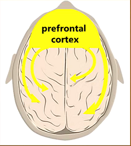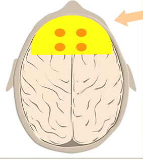
工作记忆能保存多少个信息组块？  
过去研究者认为，我们工作记忆可以保存7个项目或组块。  
而现在最新理论认为，只能保存4个信息组块。 

你的工作记忆就像一个黑板或草稿纸，他能书写东西，但容量有限，写满了必须擦除才能写其它内容。虽然你的工作记忆是一块黑板，但它不是一块好黑板，是一块很模糊的黑板，你需要不断**重复**，才能将你要处理的事情保持在工作记忆当中。 **重复很有必要**，这样不会让你的新陈代谢吸血鬼将你的记忆吸掉。 

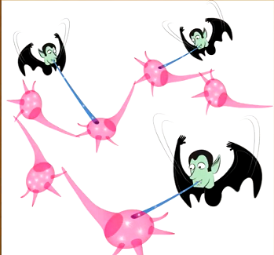
  

长期记忆 Long term memory  
  
你的长期记忆，就是一个容量近乎无限的大仓库。你所遇到的所有东西
大脑都会记住存到长期记忆当中。能记住是一回事，能被工作记忆提取到又是另一回事情。 

当你第一次将信息存入长期记忆里，你至少需要重温几次，才能增大你在需要时
找到这段记忆的可能。 

我们需要设计出 方便检索信息的技术框架。 
在长期记忆中设计一套，在你的计算机中也设计一套。 
计算机存储什么信息？ -- 我想是不值得大脑故意记住的东西，只需要做好索引和关键词，大脑要找用到时，方便查询得到即可。 
长期记忆存储什么信息？ -- 我想应该是知识结构体系和技能本能，我想应该是诗词歌赋，我想应该是你自己的哲学。 

你必须要**重复**，**重复** 几次，才能在你需要的时候想得起这段信息。

当你遇到新事物，通常是使用工作记忆来处理他们。你想把信息存入长期记忆。
你需要时间和**练习**，重复练习。 然后做的更好的是将它和其它信息相互联系上，形成网络体系(anyway),形成体系，更容易提取出来。  

为了加快存入长期记忆的过程。有一个技巧  
**间隔重复**  

这个技巧就是重复的记住你想要记住的事情。
但技巧是，每隔一段时间进行一次。 

比方说每过两天，重温一次单词或者解题技巧。

请记住，间隔重复比临时抱佛脚的疯狂重复练习要好得多。 
你考前一两天疯狂的重复练习大量分块的练习，就没有你每隔几天重复相同次数的训练来到效果要好。  

如果不留下时间让你的泥浆干掉，那么你的神经结构就不会很好。  

# 《睡眠对学习的重要性》 

睡眠可以冲刷掉大脑里的有毒物资。 
你可能很惊讶，清醒状态下，你大脑就会产生有毒物资。 
睡眠时，你大脑细胞就会收缩，细胞之间间隔就会变大，液体就会从中流过，带走有毒物资。  
睡眠能让你大脑保持健康。 
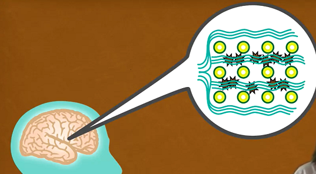

睡眠还是你学习和记忆过程中重要的部分。注意，是重要的部分。不是毫无影响的部分。

睡眠还能整理你白天学习过的知识和概念，还能擦除不重要的信息，加强你想记住的信息。  
睡眠还能预演你白天学习当中遇到最难的部分，一遍又一遍的重复神经模式。

睡眠还能帮助你理解困难的问题。 
你全部的大脑前额叶皮层，会帮助大脑其他部分彼此之间轻松交谈。 
睡眠期间，大脑将你学习任务中的不同的神经解决方案放到了一起。
当然你还得通过专注模式将你发送模式的种子种下。  
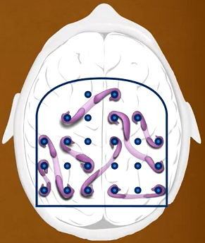  
睡前重温下你学过的知识，将提高他们出现在你梦里的机会。 
在梦里梦到你学习到的知识，能大大提升你的理解力。似乎是把信息整合成更易记住的组块。 

 
# 《采访特伦斯·塞伊诺斯基博士》
特伦斯·塞伊诺斯基简介   
Terry Sejnowski
代表作品《深度学习》，深度学习算法奠基人，人工智能先驱，还是美国四院院士，现代神经科学领域的领军人。他研究的最终目标是，利用计算模型建立从大脑到行为的联系原理。 

Q1:当您在学习全新东西的时候，您如何做才能帮助自己更轻松的学习？  
A1:我喜欢深入的了解它，而不会因为阅读大量的书籍而学到更多。 
我在研究生院读书的时候，我从物理学转到生物学，我做的就是进入生物实验室，参与实验，我坚定的相信边做边学，以及耳濡目染的向专家们学习。

Q2:在无聊的演讲中，如何保持自己的专注力？   
A2:我发现没有简单的办法可以让自己对无聊的事情保持关注。
不过我找到了一个打断演讲者的小技巧，那就是提问，中断尝尝能激起讨论，那就有意思多了。实际上这也遵循一般原则，即你可以通过主动参与学到更多，而不是被动聆听。 

Q3:您是怎么进入并利用发散思维的。   
我说下我自己是怎么进入的，散步，洗澡，蹲坑，做点劳动,或者休息放松。
A3:我发现当我慢跑或者运动的时候，这是我思维抽离常规跑道的绝妙方法。
我发现这极有可能激发心得想法和创意。就像你大脑进入了一种新的模式，你跑着一些东西从你脑海里闪过，然后你开始思考发生了什么。例如你大脑一直处理的事，无意识的想法会浮出水面，而且尝尝是一些以后会对你有帮助的新想法。我惟一的问题是记住所有这些好想法，因为当我洗完澡回来后，很多想法就蒸发了，这就是为什么我喜欢随身携带一个小笔记本，这样我就可以记住我当时的想法。

`这也给我了我启发，当遇到难题或系统性大的复杂任务时，你不知道如何是好的做法，那么硬着头皮进入专注模式，尽管去做好了，好的想法或者关键思路留给发散思维解决就行了。不用还没开始就在办公室里来来回回的渡步。`

Q4:您是否会执行多任务，或者如果您不这样做，您如何在想进行多任务时，抵抗住多任务的冲动。   
在此之间，我讲下我怎么执行多任务的。我会创建一个 worklog.txt 文件，在上面记录我所有工作的事项，一旦有任务要切换，我便立马记录当前的工作，然后便于切换回来。   
A4:如果我无法处理多任务，我将无法生存。我每天大部分时间都在与学生交流，听讲座，与许多来往访客互动，很多事情都在轰炸你，电子邮件，短信。
这些是你想做的非常重要的事情。如果你不能跳跃的处理他们，你将很难度过一天。我很享受夜晚，当一天的喧闹安静下来时，我会有机会进入一种更具有`反思性的模式` 
ps: 笔者反思做的超级不好，懒惰，不愿意做反思，其实我的反思能力很强，完全有能力做好。 

Q5:您曾经同时做过两件事吗？   
A5:你不能有意识的同时处理两件事，因为它们会混淆起来。

Q6:您如何将神经学知识运用到您的学习当中?   
A6:我认为有很多小方法，我已经运用了我在实验室中学习到的东西，
举个例子，我在萨尔克研究所的同事 拉斯蒂·加吉取得重要的发现。 
如果你阅读教科书，它会告诉你 你大脑中所有的神经元都已出生，
出生后 神经元连接并学习，并在神经元之间的连接处发生变化，
但他们是你出生时拥有的，相同的久神经元有些死了，大脑皮层会收缩。 
然后拉斯蒂 发现了在大脑中用于学习和记忆的重要部分 `海马体`,
即使在成年后也会有新的神经元诞生，这对学习和记忆非常重要，显而易见，
拥有新的神经元。我们发现，假设你有一个动物，我们将老鼠作为模型系统，
如果你为其提供了富裕的环境，老鼠能够在其中四处移动，能够与其它老鼠互动，然后看看海马体，你会发现神经元之间的连接强度在那里更强大。它可以强两倍多相比于放在有限的环境里笼子里的老鼠。 
所以现在的关键是，拥有一个丰富的环境，即使是成年人也会有帮助，
你不应该把自己锁在房间里。你真的想被别人包围，那些激发你的人，正在发生的事件，你可以积极的参与，这很重要。 
但在这里 拉斯蒂发现了 没有丰富的环境下运动也会增加新生并存在的新神经元 ，因此我现在非常热衷跑步。

Q7:这些年，您是否有什么特殊的技巧来帮助您集中注意力学习和创造？   
A7:我发现在富有创造力的环境中，其他人都有创造力。这种方式能提升你自己的创造力。我想尽管我们认为 有创造力的思考者是孤独的天才，也许有些人是这样的，但对我而言不是。`我发现当我和别人进行交谈时，并试图向他们解释我的想法时，我才有更好的主意。`(我也有相同的经历)。通常这个过程能促进创作。

Q8:考试怎么样，有什么特别建议吗？   
A8:考试和其它任一技能一样，你可以学习。你可以学习成为一个更好的应试者。我发现你需要避免的事情，例如：如果你无法回答某个问题请不要退出 ，继续下一题因为你随时可以返回。通常那道题的答案，可能会在稍后的考试里就会突然出现在你的大脑里。这就是我们大脑的运作方式，事物沿着平行轨道运转

Q9:您如何处理科学方面的创造性工作，您如何保持自己的创造力面对更多日常工作的冲击。  
A9:我非常幸运，我有一个很棒的实验室还有我的学生和同事，让我
在学习新事物方面保持年轻，用新的观点看事物，所以我认为有年轻人在身边确实是一个让自己保持年轻的好方法

Q10:关于如何有效学习知识，您有什么建议？   
A10:成功不一定源于聪明，我认识很多没有成功的聪明人。但是我认识很多他们非常富有热情而且执着，生活中有很多成功，那种激情也毅力，真正的坚持到底不懈努力，并且永不言弃。这是我从我共事的成功学生身上看到的真正最重要的品质。

主动参与能学到更多，而不是被动聆听。

# 《组块》
组块是我们大脑可以轻易获取的 信息压缩包。
我们本周会谈谈 
	- 如何形成组块 
	- 如何利用这些材料提升理解力和创造力
	- 还有组块如何提升你的考试成绩
	- 还会谈论学习过程中眼高手低的问题 
	- 在利用低效的学习方法是，让你大脑误以为是在学习，这其实在浪费时间 
	- 还会罗列哪些方法是低效的，还有哪些方法是被科学研究证明对你有帮助的 
	- 超量学习，将信息牢牢的印在你脑海里，但也可能像跑出深深的车辙-车轮在前进的过程中效率并不高，陷入深深的车辙里了。 
	- 交叉学习，可以让你的学习时间更有价值，它能提供智能的多样性

# 《什么是组块》 
当你第一次看到一个新概念时，肯定是一头雾水。
组块是神经跳跃，它通过意思将信息碎片连接在一起，从而让信息片段变成有逻辑的一个整体，这让你更容易记忆，更容易提取，这就是组块。  
如下图，  左侧是混乱的信息碎片，经过逻辑联系后，形成一个整体的组块   
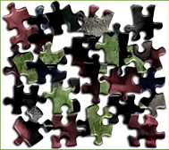 
  
  

没有理解和上下文背景，你就没法真正理解发生了什么，或者你正在学习的概念和其它概念之间的关系。

专注模式下，你大脑里的思维章鱼触角是如何工作的。   
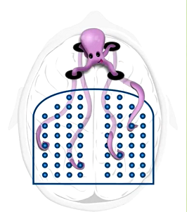
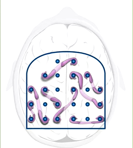  
当你专注某件事的时候，你大脑里就像有个章鱼，章鱼沿着四个工作记忆卡槽伸展出触角，伸展到大脑的各个部分，帮助你把散落的记忆联系起来。 
请特别注意，这和发散模式下的随机联系不同。   
让你的注意力集中于，把大脑的各部分联系在一起，连接脑海里的想法是专注模式学习的重要部分，这可以帮助你建立组块。   
但是要避免 压力，当有压力是，你的注意力将丢失制造某些联系的能力，
因此你的大脑在有压力、害怕、生气时无法正常工作。 
组块就是信息的片段，在神经科学角度来讲，就是通过意思和用途来绑定。 
以字母 P、O、P为例子，连在一起成为一个概念，就是容易记住的组块 - pop 
这就好像把繁琐的电脑文件压缩成一个 压缩包(chunk) 。 
单个单词 POP 的背后，是一连串彼此和谐的神经元细胞，
复杂的神经活动，将我们抽象的思维组块联系在一起。
无论联想到的是缩略词，想法还是概念都是科学、文化、艺术的基础

# 《如何形成组块》
	形成组块的一些背景知识，例如你在学习吉他弹奏一首有难度的歌曲，你脑海里关于这首歌的神经表征，可以被认为是完整的组块。
	小的神经组块组合成大的组块，大的神经组块融合成更复杂的神经组块。 
	最好的神经组块就是条件反射，不需要想就能做出判断的下意识反应。 
	当你用吉他学一首歌时，你首先会花上几天把每个小节都弹会了，然后将几个小节连在一起形成一首歌
	变成更大的组块。 

	形成组块，分三步来走。这里描述的方法是针对 精神组块建立，但对肌肉组块也是有启发的。 
	- 全神贯注，不被中断
	- 理解，要理解你要学习的事物
	- 背景认识，超越最初问题，从整体上看待你组块的位置和作用和与其他组块的连接

当你开始学习新东西时，你大脑开始构建新的神经模型，然后将其与之前存在的神经模型构建`联系`，并且散播到大脑各个位置。  
打个比方，你思维就像章鱼的触角，当你三心二意时，其它事情就会占用你本来有限的工作记忆，你思维的触角就无法触及新知识的各个方面。

第二步是`理解`，对建立的组块对象有基本的了解，无论是理解概念性的知识、还是寻找故事中不同情节的关联、或者是弄明白经济学中的供求关系、亦或者理解某种数学问题的本质，通常你都要领会所学内容的大意，(你可以轮流使用专注模式和发散模式来理解其大意)。 
理解力就像强力胶，将潜在的记忆粘合在一起，它可以建立一大圈记忆痕迹并与其它记忆痕迹连接在一起，这样你建立的组块就能更好的与其它组块
形成联系，组块之间的互动互调，联想也将更加顺溜。 你可以对没有理解的知识建立组块吗？ 可以，但它通常是无用的组块，它无法融入你整体的组块网络体系中。 因此，认识到如何解决一个问题是非常重要的。例如你学习一个知识，没有进行回顾复习，等到考试前复习，你会觉得这些知识难以理解。 对于数学和科学相关的学习，`考试`测验可以帮助你校验你哪些知识是理解了，哪些还没有，并且能加速你的学习。
当你能独立完成某件事情的时候，你才是真正的掌握了它。如果你只是在看或者理解了如何做某件事情，也不代表你真正能做到。只有真正实践操作完全掌握了它，才能建立神经模型。 就譬如，你看别人画画，不代表你就能画得出来了。 你听别人唱歌，不代表你就能唱的那么好听。   

组块化第三步，就是获取组块化的背景信息或者背景认识。背景认识是指超越最初的问题看的更高更远，练习和重复相关和不相关的问题。 
这样你就能知道何时使用某组块，何时不使用它。这样做能帮助你新建立的组块是如何融入整体框架中的。在你的解决问题工具箱中，有一件工具如果你不知道何时该`用`它，那么它对你来说意义就不大。最终通过`练习` 可以拓宽你神经网络对你组块的连接，这样能确保组块不仅仅是牢固的，而且能通过不同途径访问组块。  

学习由两部分组成，top-down bottom-up   
自顶而下的认识 以及 自底而上的组块化。 
自底向上的组块化，重复和练习能够帮助到你，建立和强化每一个组块，这样你可以在任何需要他们时使用到他们；   
自顶向下的认识，能让你清楚的知道你在学习什么，以及他们适用于哪里。 就完成掌握学习材料而言，这两个过程都很重要。背景认识就是这两个过程的交汇处，特别强调一点，组块化包含一种方法，即在学习中解决特定问题的方法，背景认识意味着你学会在特定的时候使用正确的方法。

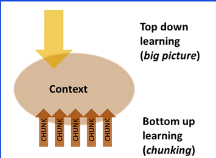

# 《Recall》 
求知的过程本身是一个学习深化的过程，
它能帮助组块的形成。
在基本的组块植入大脑之前，尝试画概念之间的关系图，这起不了作用。 在基本的组块形成之前就想对组块之间建立练习，这个方法不起作用。 
这就好比没明白国际象棋的规则，就想学习高级策略一样。

通过回忆刚刚学过的内容，而不是简单的被动重复，这会使你的学习时间
更加专注和高效。
回忆或者说测试，这是非常高效的学习方法，它比起简单的重读学习材料要难的多。其目的为了强迫大脑，从记忆中重新提取刚刚学到的知识或技能。
大脑经过艰难的回忆后，会加强这些记忆的存储和提取的能力。

当你新学习一个概念或技术时，你整个的工作记忆都会参与到这个过程，你工作记忆的四个槽之间这种疯狂的概念纠缠。

当你形成组块后，你会觉得它在你脑海里的连接变得更加轻松顺畅。

概念形成组块后，它在你工作记忆中，只占用一个槽位。同时成为一条光滑的线，更容易作为学习基础用于建立新的学习连接。（也就是说，你的学习能力变强了，越学习越快）

# 《是什么激励了你》
大部分大脑皮层的神经元，都携带了关于当下主体行为以及相关环境的信息。
大脑内有一组弥散神经内分泌系统，这个系统中包含的并非包含内容本身的信息，
而是该经历对于未来影响的信息。  
神经调节物是一种化学物质，可以影响神经元之间的传递。
乙酰胆碱 、多巴胺、血清素
乙酰胆碱，和大脑皮层的神经调节有关。
- 这对于集中注意力工作或学习很重要。 
- 这些乙酰胆碱流动范围很广，通过激活或控制突触的可塑性形成新的长期记忆。

神经调节对于潜意识也有深远影响。 

塞伊诺斯基博士关于大脑最伟大的发现之一，就是我们的动机(motivation)，
是被一种叫 多巴胺 的化学物质控制的。 
多巴胺处于我们脑干的一小部分神经元中，在下图中的菊黄色部分。   
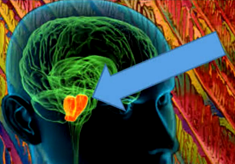 
这些多巴胺神经元是整个脑部系统的一部分，它控制着奖励学习。 
特别是，位于多巴胺上方和大脑顶部皮质下方的绿色区域-基底神经节中，
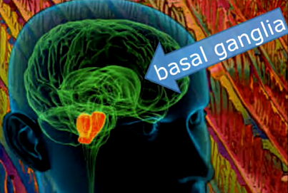  
当我们收到意料之外的奖励时，这些神经元会释放多巴胺，多巴胺信号广泛传播，对于学习有非常大的影响，
同时它也影响决策，多巴胺不仅与当下的奖励有关，同样也能预测未来的奖励，这可以激励你去做一些，当下不会有奖励但未来会有奖励的事情，
多巴胺的缺少会导致动力的缺失，继而导致快感的缺失，意思是对原本能带来快乐的活动失去兴趣。 
严重缺乏多巴胺会导致 静止性震颤，行动迟缓，僵硬，这叫做帕金森症，最终会导致紧张性抑郁障碍，表现为彻底的运动性抑制。
多巴胺就是潜意识的一部分，当你承诺自己学习后获得一些奖励时，你就进入了多巴胺系统。 

第三个弥散神经内分泌系统调节剂就是 血清素。它对你的社交生活有很大的影响。在猴群中，雄性领袖的血清素活性最高，而最弱小的雄性体内
血清素活性最低。血清素的含量和侵略行为有关，低血清素含量的猴子侵略性更高，因暴力犯罪而入狱的囚犯，体内血清素活性低。 

最后，你的情绪会强烈影响你的学习（不仅是学习哦，工作也是）。杏仁核是有效整合情绪和认知的主要中心之一，杏仁核是边缘系统的一部分，
连同海马体一起，他们可以处理记忆，产生情绪，识别情绪和调节情绪。 
高效的学习者，就应该让你的杏仁核保持积极。 情绪和神经调节系统比 行为和感知要慢，但要成功的学习，他们是一样的重要。

 
`学习的时候，及时立刻对新知识概念形成组块，这是效率最高成本最低的方法。 
学完一个新概念，立马对自己进行测试或者说回忆，然后在手写下刚过的内容，稍微重复两三遍，能立马形成组块。`

# 《组块库的价值》 压缩、转移、创造力和偶然性法则 
将各个组块以新的方式组合在一起，引发了许许多多的历史性的创新变革。
比尔盖茨和其它产业领军人，会拿出一整周时间用来阅读，用来保证在同一时间能了解不同的理念，
这样能在脑海里形成崭新而不被快速遗忘的想法相互形成网络并促进创新思维。
根本上讲，人们提升知识水平并达到专精的方式，都是在脑海里慢慢形成组块，
不管你处于什么学科，脑海里存储的知识组块越多也就越深刻，也就越容易想出解决方案并解决问题（这也是就说见得世面多，视野宽广，格局） ，
组块能帮助你理解新的概念，每当你要掌握一个组块，你会惊奇的发现这个组块
可以和你已经了解的其它组块联系起来，不光是本领域内的组块，还可以和其它领域内组块相联系（组块本来是人造的概念，神经活动才不管你当前学的是哪个领域呢，学科分类也是人造的，神经活动才不管你啥领域） ，- 这就叫做迁移。
例如，你在物理学中学到的概念和解决问题的方法很容易应用到商业领域中。 
组块是一种更有效的压缩信息的方式，在某些领域内你会发现，你形成的组块的经验越丰富，你所能形成的组块也就越庞大，组块之间的联系缎带也就越来越长，你的神经网络也更为深刻，你的记忆也更为牢固。 

我们在理解和解决问题时，有两种方法。 
第一种，sequential ,采用一步一步的推导。 
第二种，采用具有全局性的直观感受。 
推导性思维，采用专注模式，一步一步的推导演绎，直到找到答案。 
另外一方面，采用直觉常常看起来更需要创造力，让潜意识连接起几个看起来毫不相干的想法，
最困难的问题和概念通常需要靠直觉来解决的。 因为新的想法帮助你从熟知的领域迈出重要一步。 

你学习时候也许曾经遇到过这种感觉，光是一章或一部分，都有无数的问题和概念，好像永远学不完一样，
这个时候，要用到发散思维了。`越努力，越幸运`, 你只需要专注于你学习的部分，你发现一旦你将第一个概念拿下之后，不管它是什么，第二个概念的理解将变得容易一些，第三个概念将变得更容易一些。并不是说一蹴而就，但一切都变得更容易一些。 

# 《过度学习、卡壳、定势效应、交叉学习》 
**过度学习**，当我们学习一个新事物时，例如一个单词、一个概念、一个问题的解决方法，我们通常会一遍又一遍的重复练习。
但是一旦我们掌握了该单元，在继续此行为，这就是过度学习了。
过度学习有自己的使用场景，例如在进行网球比赛或者弹奏一曲完美的钢琴协奏曲，过度学习可以为你提供下意识的动作。 
如果你在考试或演讲时卡壳，过度学习也会体现它的价值。你知道嘛，一个专业的公共演讲家，在进行一次20分钟的TED演讲，
背后也要花上70小时的练习，在你紧张时，无意识的自动动作很有帮助。 

但是要警惕在一个学习单元中总是  重复的过度学习，研究表明这样做对珍贵的学习时间是一种浪费。

现实情况是，一旦你掌握了一个学习单元的基本知识，持续不断的对同一个部分进行强化，并不会达到你预期的加强你的记忆强度以形成长期记忆。 
说实话，重复你已经完全知道了解的东西，非常easy , 他会给你一种错觉，给你一种满足感，好像你已经学会了所有知识一样，而实际上你只记住了
简单的部分。然而，你需要平衡你学习的时候，你应该有意识的去学习和研究更难的部分。`专注于更难的内容，这就是刻意练习。`识别出一些困难的点，包括你的情绪抵触，天生性格等等，去挑战它，怕什么就做什么。这样疯狂的刻意练习，你会生活的更好。
这也是 区分普通学生和优秀学生之间的点。

**定势效应**这种现象是指，你一开始简单的想法，可能是脑海里已存的理念，或者是一个你已经熟练且深刻掌握的思维模式，这些可能会阻碍你相处更好的点子。你可以把定势效应理解为你对事物最初的看法，你在脑海里安装了一个阻碍你形成其它想法的路障。
这种错误思维在体育和科技领域都尤为明显，因为有时你对发生何时以及该如何做的直觉，可能具有误导性。这个时候你就要丢掉现有的想法。 

学生在学习的时候，常犯一个错，那就是在学会游泳之前跳进水里。 专精一门学科，不仅意味着你要学会基本的组块，也要学会选择和使用好不同的组块。最好的方法就是 在你遇到的问题和形势当中要来回跳跃，他们需要不同的解决方法或者说策略，这就叫做交叉记忆。 

**交叉记忆**，一旦你对学习的部分所需要的技术有一个基本的了解，这个时候，你可以把你解决不同问题的实践经验，或者不同类型的解决方法，不同的概念或过程交叉记忆起来。有可能这会有些困难，譬如说一本书中的一段，尝尝集中讲述某一个技巧，当你跳到这一段时，你已经知道你要学习使用哪一种技巧了。 

在你的学习中使用交叉记忆。例如，在你的复习中，跳着看许多不同的章节，或者学习材料中的不同问题，这让你的学习变得更加困难，但是它能帮助你理解的更加深刻。尽管练习和重复在帮助你 建立牢固的神经模型非常重要  ，但交叉记忆才是让你灵活运用并富有创造力的功臣。 
当你在某一学科学习中使用交叉记忆时，你也就发展了本学科的创造力，当你在不同学科中使用交叉记忆时，你也就更容易的在不同学科的组块间建立起有趣的连接，让你创造力得到大幅度提升，
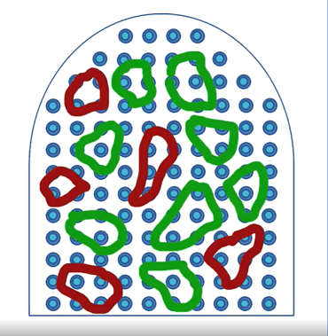  
在不同的知识领域形成稳固的知识组块需要时间，我们需要协调下，在不同领域内学习专业知识，这意味着我们可以携带一个领域内的新思想到达另外一个领域，但也意味着你没有只专攻这一个领域内的人知识和技能掌握的熟练(这好像是伪命题，费曼也是一个经常跨领域的高手，虽然不能说他在各领域内都是同时代人中的top1,但也绝对是top 0.01% 的存在)。
但是你专攻一个领域，你也许理解很深刻（不见得把？一个领域内知识再多和视野再广，总归也是有限，等学的差不多了又没新发现，我猜他们脑子将停止思考，进入认知放松模式，或者说钻入死胡同了）组成这世界本来就是多领域（但物理学家在探究终极统一方程，但这也意味着是结束，而是新世界的开始）

科学史上的 重大发现，尝尝是由年轻人发现的，或者是其它领域转行过来的人发现的，他们不容易陷入思维定势。

思维定势效应可以理解为你对事物最初的看法，但不幸的是，时代在变且你还意识不到你最初掌握的概念含义也在跟着变化，你被淘汰掉。  
这就像你脑海里安装了一个阻止你形成新的想法的路障。 

专精一门新的学科，不仅意味学会基本的组块，也意味着学会选择并用好不同的组块，

# 《拖延和记忆》 
本周我们要讨论关于拖延和记忆，这两个看起来毫无关联的概念，其它密切相关，为什么？ 
在长期记忆里建立组块，已经在工作记忆里方位这些组块，这都需要时间，而这是我们非要拖延到最后1分钟才做的事情。 

我们已经掌握了一个对抗拖延症的方法--番茄工作法
本周我们会深入讨论拖延症的细节，以及如何克服拖延的方法（不用耗费意志力的方法）
还会讨论最好的 访问你长期记忆系统的方式。 

# 《解决拖延症比你想象的要容易》 
我们来了解下 关于拖延症的 认知心理学，这和我们了解毒药的化学原理，帮助我们研制预防药物的道理是一样的。 
本周会介绍 治疗拖延症的 懒人办法。这也意味着你将会了解你内心的自我，一个你从没意识到的自己。 
大脑在得到一个明确的提示后，你的正常习惯性反应。内心的自我往往更贪恋此时此刻的美好。你可以诱导内心的自我，在需要的时候
帮助自己避开拖延症，哪怕拖延症已经很严重了，或者你对付拖延症已经有一套了，都会从中获得收获。自己也能更好的安排学习上的轻重缓急。大家都不希望死记硬背，因为那样建立不了稳固的知识网络结构，这都是在浪费时间。
但是 合理安排，提前开始，你的学习效果会更好。
首先，端正下我们的认识，我们大脑很容易陷入拖延症，这个不是你一个人的问题，你并不孤单。 
但意志力不一样，很难控制，并不是所有人意志力都很坚强。意志力需要大量的神经资源，`除非必要，不要将意志力用在对抗拖延症上。 `  。 其实你压根用不着对抗 拖延症。接下来我们会让你看到理想的效果。    
拖延症的心理过程  
我们回顾下，让我们拖延的事情，通常是让我们感到不舒适的事情。   
- 你想到的是极其不喜欢的事情，大脑中的痛苦中枢点亮了 ； 
- 然后你将注意力 倾注在 更愉悦的事情上 ；
- 这样你会感觉好一些，至少短时间是这样的。  
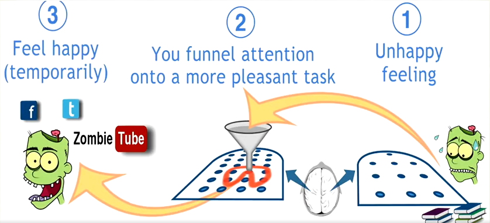

非常难受的是，惯性的逃避产期来看，后果是极其不好的。 
你会讨厌自己，看不起自己，觉得自己不行，做不到，愧疚，一堆负面情绪。     

如果推迟去学习，想到要去学习这件事情会更加痛苦。 
`停止吃花生最好的办法是，放下手里这把花生，而不是告诉自己吃完这一把就不吃了`
同样了，克服拖延症最好的方法，就是拿起书来，进入专注模式，不管学的进学不进去，注意千万不要给你自己负面的评价。而不是告诉自己再刷10分钟抖音就去学习。 

拖延症会成为非常严重的基础性陋习，它会影响到你生活中很多重要方面，也就是说你的生活质量都会受拖延症影响。 
对称性的，如果你能改变拖延症，那么你生命中的很多积极性的改变会逐渐发生。 

拖延症和成瘾有一些共同点。 
- 都能从无聊和困难的现实获得短暂的刺激和放松； 
譬如大家很容易欺骗自己，认为某一个片刻最好拿来刷微博抖音，而不是正儿八经的看课本。 
你会开始编故事，譬如 有机化学需要空间推理能力，这是你的弱项，所以很明显学习效果不是很好。
你会为自己编一些听起来貌似合理的理由，如果我太早准备考试的内容，那么学过的东西就会忘记。 
如果被拖延症困扰，“你会很歪理的告诉自己，拖延症本来是一种先天的人性特征，不可改变，要不然不会有那么多人都有拖延症了。
他们不也一样克服不了拖延症嘛。”你看看这个话多混蛋。
越深入学习，控制拖延症就越重要。多年来的习惯可能回过头反咬你一口。
接下来的章节，向你展示如何做习惯的主人。
你应该由你自己做主。  

# 《深度理解拖延症》 
> 内心的自我随处可见，深度理解拖延症 

想象一下，你人生中第一次倒车离开车道的情况，整个大脑保持全神贯注的警备状态，四面八方的信息裹挟着你，这一项任务变得特别困难。
但其实你把整个倒车拆解为几个步骤，心里想着这几个步骤，然后行动，然后倒车就完成了。 你大脑进入了内心的自我状态，不能完全吸收所有的数据，只对一些关键因素有一种不充分的意识。这和骑自行车很类似，刚开始很难，过一会儿就简单了。    

从神经科学角度来讲，分步操作和习惯有关。 
习惯为我们省了很多精力，我们才能分心做其他事情。
进入惯性的自我状态，比想象中的更频繁一些。 
做习惯性的活动时，你无需有意识的去想自己在做什么，这样节省了精力 

习惯有好有坏，短时间的习惯譬如整理头发，长时间的习惯例如散步。 
你可以把习惯拆解为 四个部分 
- The cue   
这是触发你进入内心自我状态的因素，提示可以很简单，譬如看到任务清单上的第一件事，要开始做下周的作业了。再比如看到朋友发来的微信，该停止工作了。  
提示本身不会帮助到你，也不会伤害到你。重要的是日常习惯，重要的是对提示的反应。   
- The routine  
你进入了内心自我状态，大脑在到提示时的惯性反应。
内心自我的反应可能有用无害，但有时也会有害
- The reward  
习惯的形成和持续是因为我们能从中获得奖励，我们能直接获得一点小快乐，
拖延症也很容易养成，因为让大脑关注更令人愉快的东西，这种奖励来的`又快又简单` 。 好习惯也可以有奖励，想办法奖励自己学习的好习惯，对避免拖延症这件事特别重要。 
- The belief  
习惯因你对它的信念而产生了力量 ，例如 你可能觉得自己永远不能改变自己，把学习推迟习惯了 。要改变一个习惯，你就必须改变自己潜在的信仰。

# 《过程和结果的较量》  
当你开始学习一门新课程，开始情绪还蛮消极的，但这都是正常的事情。  
但是你要如何处理这些情绪呢？  
研究者发现，没有拖延症的人会把消极情绪放置一边，不去批判自己，着手做就是了，不管结果和过程如何。最重要的是，你要开始，`只要一开始你就会感觉好很多`。 
如果你发现你一直逃避某些任务，只是因为这些任务让你感觉不舒适，那么你应该要有清醒的认识，你有其它办法来重新安排这些任务。 这个方法就是关注过程而不是结果。   

**关注过程而不是结果**  
为了防止拖延，你要避免关注结果，而是把注意力放在过程的构建上。  
过程和简单的习惯有关，也就是这些习惯让你坚持做自己必须做但不喜欢的事情。  
例如，你不喜欢做某门课的作业，你会一直磨磨蹭蹭 ，但其实只有5道题，完成作业有多难？  
在内心深处，你知道完成这5道题要花很久时间，轻轻松松玩不好吗？ 只要在最后1分钟 完成五道题或者十页报告就好了。   
你的挑战就是避免关注结果，不去想问题答案，结果才是造成痛苦的触发器，最终会导致你一直拖延，你应该更多的关注过程，也就是你应该关注你一天或一周里用来学习或准备考试的时间，谁会在意你完成了作业呢？谁会在意你是否真正掌握了某一个概念呢？ 相反，全部的意义在于，这段时间你平静的付出了最大努力。对于我们来说，帮助我们关注过程的最简单办法就是 番茄工作法。 关注过程这也其实 有点类似于 `正念`的概念。就是劈柴时只想着劈柴，烧水时只想着烧水，而不是劈柴时心里还想着烧水。    
这其中根本的道理就是，大脑中已经形成了惯性的自我喜欢过程，因为行动起来不必花费心思，利用内心自我友好的部分来帮助自己实现关注过程会更简单，结果其实也会向好。 

还有一点，我认为是最重要的一点，也是实现你人生过得好的一点，通过对过程而非结果的关注，它能避免让对自己的评判。 `不要苛责自己，不要骂自己无能，不要愧疚，你本身能活着就已经很了不起了`   
关键时，不可避免的分心因素出现的时候，你要识别它，你得意识到自己要分心了，然后训练自己使它自行消散，使分心自行离开你。 这也是我常说的，你得要长出两个脑袋出来，一个做事情，一个做监工负责`欺负`你自己。 当然了，即使有监工存在，监工也无权利贬责你。你还是那个活泼跳跃，生命力，开心的你。  

 

关注结果，也会导致动作和心态变形。例如 打王者荣耀， 
我水平是属于辣鸡那种，而且我也不会专门训练提升水平，这是我背景概述。
有一次我玩王者荣耀，有可能是队友厉害，也可能是对手菜，加上自己运气好，没一会儿我就全队人头数最多了，MVP 。啊~ 我动了攀比自己，想维持这个自己第一名的排名到比赛结束，结果就是导致心态变了，屡屡冲出去受死啊。 哈哈 ，最后比赛结果，我当然没拿到mvp 了。 
其实拿不拿到mvp和我关注不关注结果没关系，但是我一旦关注结果，我的游戏体验，感受就差了。 

结果才是造成痛苦的触发器，这论断对吗？ 
在原始社会，人们没作业不会有作业的痛苦，但他们也会有痛苦嘛？ 
痛苦是人类一直就有的情绪感受嘛？ 还是进入文明社会才有的情绪感受？  

关注结果会造成痛苦，和比自己厉害的人对比也会造成痛苦，还有什么会造成痛苦？

# 《如何给你大脑做大保健》
- 给你大脑充足的能量 ，他自己产生不了能量，他需要能量供给。
- 给他睡眠啊，冲刷掉清醒状态下产生的有毒物资。
- 来点运动，产生一些脑源性神经营因子，别再说四肢发达、头脑简单。其实头脑也发达。 
- 吃点坚果哈，里面含有非饱和脂肪酸，他产生包裹你轴突的髓鞘的好物资。 
- 放松下，真实情况可以来一次大保健，你大脑需要轻松愉悦的环境氛围，他需要发散状态。  
- 一个丰富多样的环境，这会刺激你海马体部分的神经元连接强度变强还有新生神经元。所以走出去，别锁在家里。

# 《利用你的内心来帮助自己》
> 本节，会介绍如何利用内心的惯性力量，来帮助自己避免拖延症，同时尽可能的不使用意志力  

大家并不想把自己的长期习惯完全改变，只想改掉某一些并养成新的习惯。 

改掉习惯的技巧就是，留意并改正自己对于提示的反应。
唯一用到意志力的地方，就是改变自己对于提示的反应。如何理解这一点呢？我们回顾下习惯的四个组成部分。 从拖延症的角度加以分析。 

习惯的四大组成部分  
- The cue    
- The routine  
- The reward  
- The belief   

**The cue** 找到是什么让你成功进入内心自我的拖延状态。提示通常有四大类：  
  - location  
  - time  
  - how you feel  
  - reactions   
地点、时间、你的感受以及反应 ,无论对他人还是对刚刚发生的事情都一样。 你是否在正在网上找着资料，却发现自己开始浏览网页了，微信是不是影响到你的学习，你要花十分钟时间才能回到手边的事情上。哪怕自己已经尽可能的集中注意力了。 

拖延症的问题在于，`这是一种无意识的习惯` 下意识的习惯，被系统1控制着。自己往往意识不到自己已经开始拖延了。你可以短时间内把手机关机掉，或者关闭微信等其它分心因素，以此来躲避危害性最高的提示，就像番茄工作法一样，

**The routine** 比如说 你的注意力很容易转移到相对不那么痛苦的事情上，而非自己的学习上。收到提示后你的大脑会自动进入到这一日常习惯上去。 那么，就在这一刻，你必须积极引导自己的习惯（这是唯一用到意志力的地方）。引导的关键就是制定计划，
培养新的习惯很有帮助 ,有些同学养成习惯的方法就是进教室前把手机放在车上，这就减少了一个很大的分心因素。很多同学发现，在图书馆或家的附近安静的一角做事，效果很好。关掉网络，在你专门的时间里，坐上你特别喜欢的椅子里，也很高效。刚开始你的计划不会那么顺利，只要坚持，需要的话稍作调整，计划奏效时，享受胜利的喜悦把。 不需要逼自己一下子改变所有的事情，番茄工作法改变对提示的反应方面非常有用。

 - plan  

**The reward**  奖励还蛮难设定的。这需要进行一些调查，
`你为什么会拖延?` 能不能用情绪上的奖励来替代完成某件事的自豪感，尽管事情微不足道，但也是一种满足感。   
能不能赢得内心的一个小赌注或争取赢得自己给自己定的小游戏奖励自己一杯咖啡，或者看看最喜欢的网站。无需担心其它事情只看电视的一个晚上 ，亦或者网上冲浪而不必有丝毫的罪恶感。
成果越大，奖励越大。甚至奖励自己看一场电影，买件运动衫或随意购买一样东西。   
要记住`习惯很强大`,因为他们创造了神经性的渴望。  如果想克服之前的渴望，给自己奖励特别有帮助 ，只有大脑开始期待奖励时，所有的重要的习惯引导才会发生。很多人发现在特定时间给自己奖励，比如中午和朋友一同在熟食店吃饭，下午五点结束主要的工作，就像一小段截止时间，有助于激励自己完成工作。  
如果开始不能流畅进行，不必感到沮丧。我有时候也需要好几轮的番茄工作法，坚持好几天的沉闷工作，才能真正进入状态，自己也开始享受工作中的新主题。另外，事情做的越好，你就越享受。

**The belief**改变拖延习惯最重要的部分，就是相信自己能够做到，你发现事情有压力时，自己很渴望回到层级舒适的旧习惯上去，相信新系统有效，你才能顺利坚持下去。 形成自己的新社交圈。和班里的同学一起玩，也可以和网课同学一起玩，也许他们有你一直羡慕的乐观进取人生观呢，和志趣相投的人相互鼓励，也能让我们记得，在脆弱的时候，我们都很健忘 。

# 《兼顾学习和生活》
对大多数人来说，学习涉及到许多复杂任务的平衡，对于你要学习或完成的事情，保持注意力的一个好方法就是，
每周把计划日志里的关键任务 ，列成简洁的周计划。然后每天在你计划日志的其它页，写下你可以合理完成的工作事项的任务清单。试着在前一天晚上写下每天的任务清单。   

为什么要前一天晚上列出你每天的任务清单呢？  
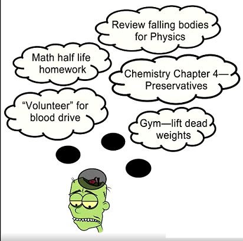 

研究表明：第一，这有助于你向你的潜意识植入任务清单；   
第二，如果不下下来，这些代办事项会一直pendding 在你有限的工作记忆当中，你会很累啊，时不时要想起来下要做什么事情，担心忘记了。这多消耗你的脑力资源啊。而且通常你还是会忘记一两件事情的，如果你不写下来。   
所以，将任务清单写下来，可以解放你的大脑。  

来看看我的日常任务清单 
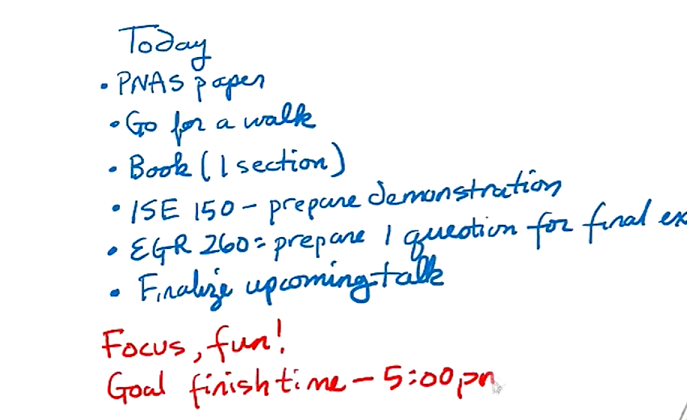  
可以看到上图，只有六项任务。 有些是以过程为导向的，例如 我还有一篇论文几个月后就要刊载了。所以大多数时间，我专注完成它 。有些项目是以结果为导向的，但那只是因为 它在一段时间内是可行的。  

> 注意,当我做没件事情的时候，我想集中注意力，并且想愉快的进行。我的确发现自己偏离了规定，因为我发现了自己忘了关邮箱  
为了让自己回到状态， 我设置了一个22分钟的番茄闹钟，为什么是22分钟，为什么不可以是22分钟呢? 我不必每次都做同样的事情，也要注意通过切换到番茄工作法 ，我转向了过程导向，我的清单上没有一项是很大的事情。   
因为这一天，我还有其它的一些事情要做，要参加的会议，要做的演讲，有时我也会穿插一些小任务，譬如锻炼身体，甚至是做一些清洁工作，特别讨厌清洁工作，但这变成了一项放松的进入到发散思维的时间，这让我变得还有些期待做清洁工作了。  把其它工作和学习混在一起，似乎每件事情都变得有趣起来了。 并且可以让你避免长时间的不健康坐着 。  
久而久之，我积累了一些经验，我可以估算出每项任务所需要的时间。`当你对于在一定时间内能合理完成的事有更切实的计划时，你会发现你在迅速的进步`.   
在你的计划表上 写下笔记，写下什么可行，什么不可行。注意，我一天任务完成的时间，下午五点。  
看起来不太对对吧，大家都996呢！ 但它是正确的，是你计划表中的重要部分之一。计划好停止工作的时间 ，与计划好工作时间 是一样重要的。 

随着时间的推移， 那些在努力工作的同时保持健康休息的人，比那些固执追求无休止工作的人表现的要好。  
当然你的生活，可能不适合这种带有休息和闲暇时间的计划表 ，你可能有两份工作和太多的课程，但无论你的生活怎样，应该挤出一点时间来休息。  

还有一件重要的事情，"早晨应该吃青蛙"，这是一句俗语，表达的意思是应该先做最重要和不喜欢的事情。 
核心矛盾优先解决下，（这里有一点要分析的时，大部分人通常会以勤劳的工作，来逃避对于核心矛盾的介入）  
我也一样的啦。逃避核心矛盾，能晚一点时间做越好。这又是一种拖延症。外人还很难发现它。   

当然，你要调整你的计划表，来应对不确定的事件 ，不可预见的事情 。  
记住幸运法则，命运总是眷顾那些 努力尝试的人。良好的计划是尝试的一部分，关注你的学习目标，尽量不要因为偶遇到困难而感到不安。  

# 《Rose's Question》

- Question 专注模式 思维触角，与发散模式的触角工作模式有什么区别？ 